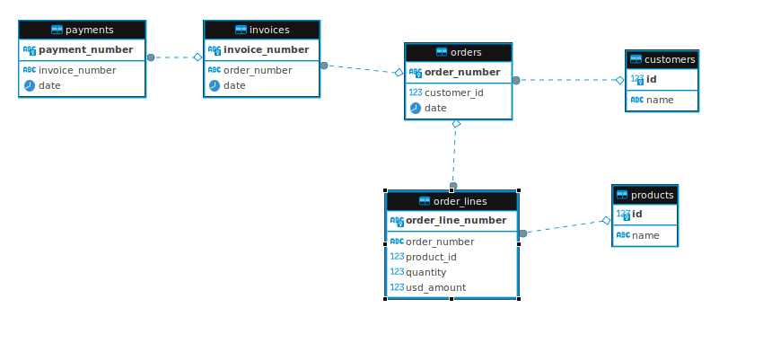
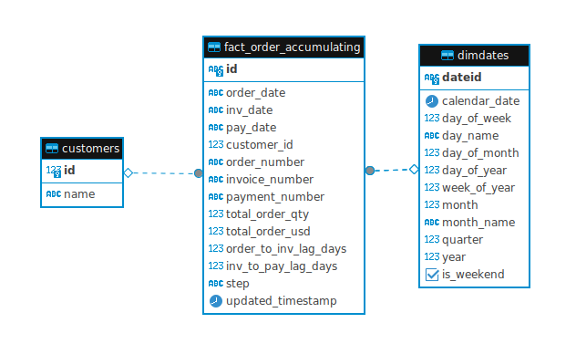
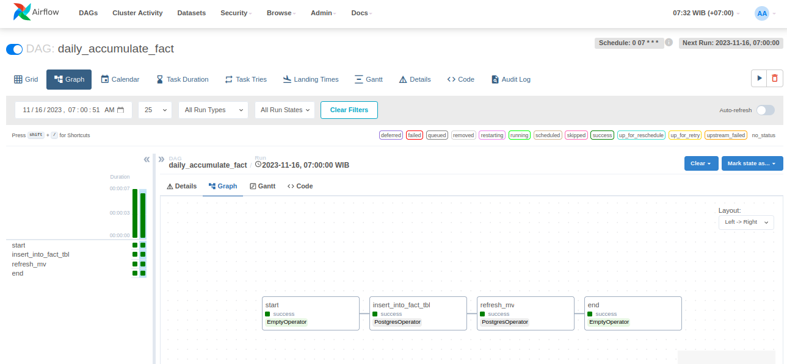
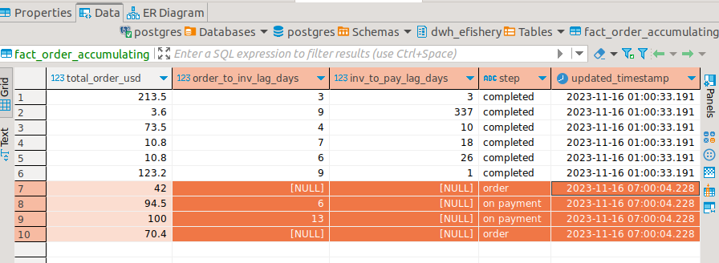

# Efishery Technical Test

## 1. Scheduling Airflow

Given table from production as  that want to be analyzed, so the datawarehouse needed to store the data from production with schedule daily at 07.00 WIB. We need accumulation of transaction that aggregation by date, customer, order, payment and invoice. 
. 

On table fact_order_accumulating we add id as primary key that usefull for upsert the data, because **just only data not completed (no payment and no invoice)from production that we insert into datawarehouse**.
Apache Airflow used for schedule and Orchastre the pipeline and provide 2 DAGS, `first_run` that get all data from production to datawarehouse and another is to get not completed data(no payment, no invoice) daily at 07.00 WIB

Only data not completed was updated 

### Directory Tree:
    .
    ├── dags 
    │   ├── daily_acummulate_dag.py
    │   ├── first_run_dag_accumulate.py
    ├── image-1.png
    ├── image-2.png
    ├── image-3.png
    ├── image-4.png
    ├── image.png
    ├── n.ipynb
    ├── README.MD
    ├── soal_2
    │   └── transform_json.py
    └── sql
        ├── daily_upsert_into_table_fact_order.sql
        ├── first_run_create_table_dwh.sql
        ├── first_run_insert_into_table_fact_order.sql
        ├── first_run_mv_fact_order_accumulating.sql
        └── first_run_v_fact_order_accumulating.sql

## 2. Transform JSON File
Transforming JSON file contained `keys` and `values`, each dictionary has 2 `values`, first `values` contain the name of fish and second contained amount of fish. 
We assume if length of `values` from fish name is equal with leght of `values` from amount of fish will be processed, and if length is not equal, `values` of fish amount is append as much as `values` of fish name. 

Example :

`values_name_fish` = ['lele', 'bawal', 'nila']   
`values_amount_fish` = [2,2,2]

example data above will be processed, and if `values_name_fish` and `values_amount_fish` not equal, we have to processed and append the values length is equal with values_name_fish

`values_name_fish` = ['lele', 'bawal', 'nila']  
`values_amount_fish` = [3]

will be processed as:

`values_name_fish` = ['lele', 'bawal', 'nila']  
`values_amount_fish` = [3,3,3]

After processing, we take out the `values_name_fish` if not contain word name of fish